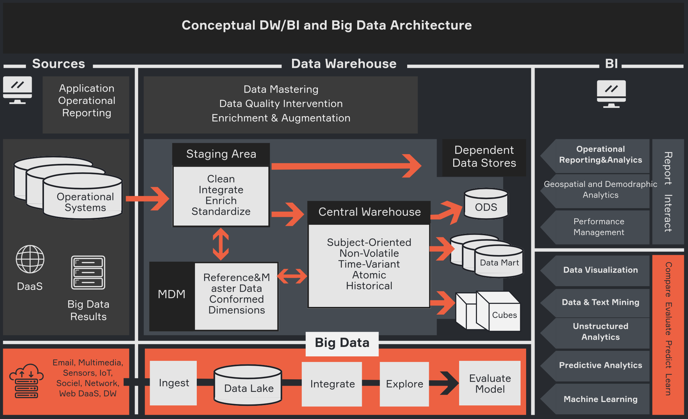
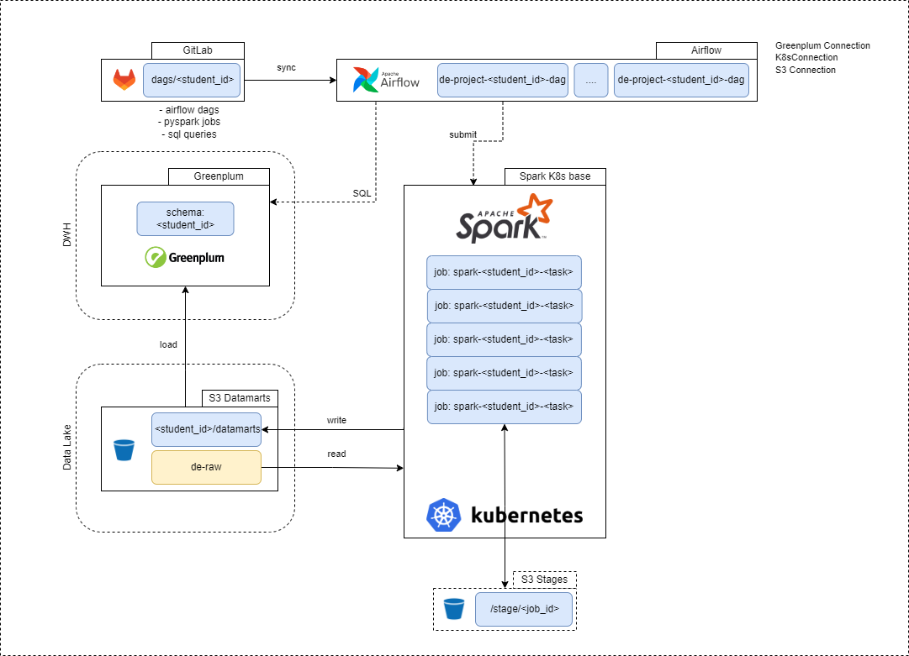
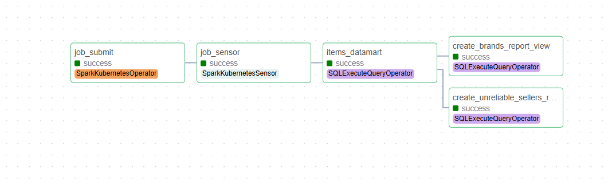

# Marketplace Data Platform

End-to-end data pipeline for marketplace analytics, implementing a modern data platform architecture:
S3 (Data Lake) → Spark → Airflow → Greenplum (DWH)

---

## 📌 Project Overview

This project demonstrates a full data engineering pipeline, including data ingestion, transformation, orchestration, and loading into a Data Warehouse.

The pipeline processes marketplace product data and builds analytical datasets for downstream usage.

---

## 🧠 Business Goal

The goal of the project is to build an analytical data pipeline and create data marts with key metrics for marketplace analysis.

---

## ⭐ Key Features

- End-to-end data pipeline (Data Lake → Spark → DWH)
- Distributed data processing with Spark
- Orchestration with Airflow (Kubernetes-based execution)
- External tables in Greenplum over S3
- Analytical data marts for business use cases

---

## ⚙️ Tech Stack

- Python
- Apache Spark (PySpark)
- Apache Airflow
- S3 (Data Lake)
- Greenplum (DWH)
- SQL
- Kubernetes

---

## 📦 Data

The dataset is stored in parquet format and represents marketplace product data.

### Raw Data (S3 - Data Lake)
- multiple parquet files (~1M records)
- contains product attributes, pricing, stock and sales data

### Processed Data (Data Mart layer)
- enriched dataset with calculated metrics
- stored in parquet format

Sample data is available in the repository (data_examples/).

---

## 🧾 Data Schema

Main fields:

- sku_id (bigint)
- title (string)
- category (string)
- brand (string)
- seller (string)
- availability_items_count (bigint)
- ordered_items_count (bigint)
- item_price (bigint)
- item_rate (double)
- days_on_sell (bigint)

Calculated fields:

- potential_revenue
- total_revenue
- avg_daily_sales
- days_to_sold
- item_rate_percent

---

## 🏗️ Architecture

### Logical Architecture


### Technical Architecture


### Airflow DAG


---

## 🔄 Pipeline Description

The pipeline consists of the following steps:

1. **Data ingestion**
   - Raw data is stored in S3 in parquet format

2. **Data processing (Spark)**
   - Data cleaning and transformation
   - Joins, aggregations, window functions
   - Feature enrichment

3. **Orchestration (Airflow)**
   - Spark job execution via SparkKubernetesOperator
   - Monitoring via SparkKubernetesSensor
   - SQL transformations in Greenplum

4. **Data Warehouse (Greenplum)**
   - External tables over S3
   - Analytical views and data marts

---

## ⚡ How It Works

1. Raw data is stored in S3 (Data Lake)  
2. Spark job processes and enriches data  
3. Airflow orchestrates execution and dependencies  
4. Processed data is exposed via Greenplum external tables  
5. Analytical views are created for reporting

---

## 🛡️ Reliability

- Airflow retry mechanism is used for fault tolerance  
- Spark job execution is monitored via sensor  
- Pipeline is designed to be idempotent
  
---

## 📈 Scalability

- Data is processed using distributed Spark jobs  
- Storage is based on S3 (scalable object storage)  
- Architecture supports large-scale data processing

---

## 📊 Calculated Metrics

- `potential_revenue` — potential revenue from available stock  
- `total_revenue` — revenue considering returns  
- `avg_daily_sales` — average daily sales  
- `days_to_sold` — estimated days to sell remaining stock  
- `item_rate_percent` — ranking based on product rating  

---

## 📈 Data Marts

### 1. Brands Report
Aggregated metrics by brand:
- total revenue
- potential revenue
- number of items

### 2. Unreliable Sellers
Identification of unreliable sellers based on:
- long selling period
- mismatch between stock and orders

---

## 🚀 Results

- Processed over 1M records in distributed environment  
- Built full analytical pipeline: Data Lake → Processing → DWH → Data Mart  
- Automated data workflows with Airflow  
- Delivered reporting-ready datasets for analytics   

---

## 📂 Project Structure

```text
marketplace-data-platform/
├── configs/
├── dags/
├── data_examples/
├── docs/
├── images/
├── spark_jobs/
└── sql/
```
---

## 📚 Documentation

- [Project Description](docs/project_description.md)
- [Architecture](docs/architecture.md)
- [DAG Description](docs/dag_description.md)

---

## 📌 Notes

This project was implemented in a training environment simulating a real-world Data Engineering workflow, including distributed processing, orchestration, and DWH integration.

---

## 👩‍💻 Author

Maria Shkurat — Data Engineer

Focused on building data pipelines, data warehouses, and analytical systems.

Tech stack: Python, SQL, Airflow, Spark, ClickHouse, PostgreSQL
